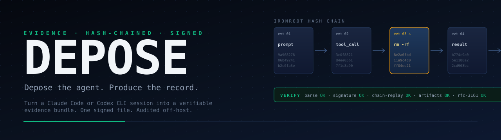

<p align="center">
  
</p>

<p align="center">
  <strong>Forensic evidence bundles for AI coding agent sessions.</strong><br>
  Hash-chained · Ed25519-signed · RFC&nbsp;3161-timestamped · verifiable off-host with a single Go binary.
</p>

<p align="center">
  <a href="https://github.com/Aftermath-Technologies-Ltd/depose/actions/workflows/ci.yml"></a>
  <a href="https://github.com/Aftermath-Technologies-Ltd/depose/actions/workflows/verify-examples.yml"></a>
  
  
  
  
  
</p>

<p align="center">
  <a href="#why-depose">Why</a> ·
  <a href="#install">Install</a> ·
  <a href="#quick-start">Quick start</a> ·
  <a href="#how-it-works">How it works</a> ·
  <a href="#whats-in-a-bundle">Bundle</a> ·
  <a href="#active-capture">Active capture</a> ·
  <a href="#examples">Examples</a> ·
  <a href="#repository-layout">Layout</a> ·
  <a href="#development">Dev</a> ·
  <a href="#documentation">Docs</a>
</p>

---

## What it is

DEPOSE turns a Claude Code or Codex CLI session into a self-contained,
hash-chained, cryptographically signed evidence bundle — verifiable off-host
by anyone with a single Go binary and no other DEPOSE infrastructure.

It is the record you wish you had the moment *after* something went wrong:
a wiped production database, a deleted directory, a destroyed cloud account.
Point DEPOSE at a session log and it produces a `.depo` bundle an auditor,
regulator, or court can verify themselves.

## Why DEPOSE

Agent transcripts on disk are not evidence. They are unsigned text files
that anyone with shell access can rewrite. When an AI coding agent does
real damage, the question stops being *what happened* and becomes *what
can you prove happened, to a third party who does not trust your laptop*.

DEPOSE answers that question with three properties that hold off-host:

| Property | Mechanism |
|---|---|
| **Tamper-evident** | IRONROOT hash chain over events; any byte change fails replay. |
| **Authenticated** | Ed25519 manifest signature; sealed by a key the producer controls. |
| **Anti-backdated** | RFC 3161 timestamp from FreeTSA (DigiCert fallback) anchors the bundle to a moment in time. |

No LLM sits in the signed path. Narrative prose is templated from signed
events and excluded from the root hash, so reading it cannot taint the
record.

## Install

```bash
git clone https://github.com/Aftermath-Technologies-Ltd/depose
cd depose
pnpm install
pnpm build

# Standalone verifier (Go 1.22+)
cd apps/verify && make build-local
```

Requirements: **Node.js ≥ 20**, **pnpm 9**, **Go 1.22+** for the verifier.

## Quick start

**Produce** a signed bundle from a Claude Code session JSONL:

```bash
./packages/cli/bin/depose package \
  --from-claude path/to/session.jsonl \
  --skip-timestamp
```

`--skip-timestamp` skips the RFC 3161 network call; omit it for production.

**Verify** the bundle from any host:

```bash
./apps/verify/build/depose-verify verify path/to/incident-<bundleId>
```

A passing run prints:

```
parse           OK
signature       OK
chain-replay    OK
artifacts       OK
timestamp       OK
PASS  bundleId=01J... rootHash=99a96827806b4924...
```

Full command surface: `depose --help` (`reconstruct`, `package`,
`install --claude`, `install --shell`, `explain`, `uninstall`).

## How it works

Six layers. Each does one thing. None LLM-narrated.

```
CAPTURE  →  NORMALIZATION  →  RECONSTRUCTION  →  INTEGRITY  →  BUNDLE  →  NARRATIVE
```

| Layer | What it does | Package |
|---|---|---|
| **Capture** | Hooks and shims record events at execution time. | `packages/capture-claude`, `apps/capture-shim` |
| **Normalization** | Claude Code JSONL, shell history (bash/zsh/fish), and git reflog → common event schema. | `packages/core` |
| **Reconstruction** | Sort, merge across sources, deduplicate, flag gaps, build a causal timeline. | `packages/core/reconstruct` |
| **Integrity** | IRONROOT hash chain, Ed25519 signing, RFC 3161 timestamping. | `packages/chain` |
| **Bundle** | Deterministic `.depo` directory layout. | `packages/bundle` |
| **Narrative** | Handlebars-templated prose with `[#evt-<ulid>]` citations. Excluded from root hash. | `packages/narrative` |

Design rationale and threat model in [docs/architecture.md](docs/architecture.md) and [docs/threat-model.md](docs/threat-model.md).

## What's in a bundle

A `.depo` is a deterministically-ordered directory:

```
incident-01JABC.../
├── manifest.json            ← bundleId, rootHash, signatures, timestamps
├── events.jsonl             ← every event in canonical JSON
├── rules/destructive.yaml   ← ruleset used at reconstruction time
├── narrative.md             ← templated prose with per-event citations
├── narrative.html           ← same, rendered
├── verify.txt               ← human-readable verification summary
├── artifacts/               ← captured file diffs, payloads
├── attestations/            ← signatures, RFC 3161 tokens
└── raw/                     ← source JSONL, shell history fragments
```

Tampering with any byte in any tracked artifact causes verification to fail.
Format spec: [docs/bundle-format.md](docs/bundle-format.md).

## Active capture

Reconstructing from a JSONL after the fact is the lower-bound mode.
For sessions you are running *now*, install hooks that record events
at execution time:

```bash
depose install --claude   # registers Claude Code PreToolUse hook
depose install --shell    # shims terraform, aws, gh, kubectl, psql, gcloud, railway, rm
```

Capture records land under `~/.depose/captures/`. Later `depose package`
runs merge them with the session JSONL so every covered event has a
verified pre-execution intent on record.

Coverage matrix and threat-vs-coverage tradeoffs:
[docs/capture-coverage.md](docs/capture-coverage.md). Install details:
[docs/hook-installation.md](docs/hook-installation.md),
[docs/shim-installation.md](docs/shim-installation.md).

## Examples

Two synthetic reconstructions are checked in. Each ships a Claude Code
JSONL and a `produce.sh` that runs the full pipeline:

- **[datatalks-reconstruction](examples/datatalks-reconstruction)** — agent runs `rm -rf` on a training-data directory.
- **[pocketos-reconstruction](examples/pocketos-reconstruction)** — agent runs `terraform destroy -auto-approve`.

```bash
bash examples/datatalks-reconstruction/produce.sh
```

CI rebuilds both bundles on every push and validates them end-to-end.

## Repository layout

```
packages/
├── core/             event schema, normalization, reconstruction, ruleset matcher
├── chain/            hash chain, Ed25519 signing, RFC 3161 timestamping
├── bundle/           .depo format reader/writer
├── narrative/        Handlebars-based deterministic narrative renderer
├── capture-claude/   Claude Code PreToolUse hook
└── cli/              `depose` command
apps/
├── verify/           `depose-verify` static Go binary
└── capture-shim/     shell shim Go binary
rules/                destructive-operations ruleset (YAML)
examples/             synthetic reconstructions
docs/                 architecture, threat model, bundle format, install guides
```

## Development

```bash
pnpm build       # tsc --build across all packages (project references)
pnpm typecheck   # tsc --build --noEmit
pnpm lint        # eslint
pnpm test        # vitest run — 198 tests across 17 files
```

CI runs lint, typecheck, the full test suite, cross-compiles the Go
verifier for darwin/linux × arm64/amd64, and re-produces + verifies
both example bundles.

## Documentation

| Doc | What |
|---|---|
| [architecture.md](docs/architecture.md) | System design, two-binary model, data flow. |
| [bundle-format.md](docs/bundle-format.md) | `.depo` spec — layout, canonical JSON, hash chain. |
| [threat-model.md](docs/threat-model.md) | What DEPOSE defends against, what it doesn't. |
| [capture-coverage.md](docs/capture-coverage.md) | Coverage matrix per capture mode. |
| [hook-installation.md](docs/hook-installation.md) | Claude Code PreToolUse hook setup. |
| [shim-installation.md](docs/shim-installation.md) | Shell shim setup. |
| [legal-considerations.md](docs/legal-considerations.md) | Evidentiary use, jurisdictional notes. |

## License

[GNU Affero General Public License v3.0 only](LICENSE) (SPDX: `AGPL-3.0-only`).
© Aftermath Technologies Ltd. and contributors.
